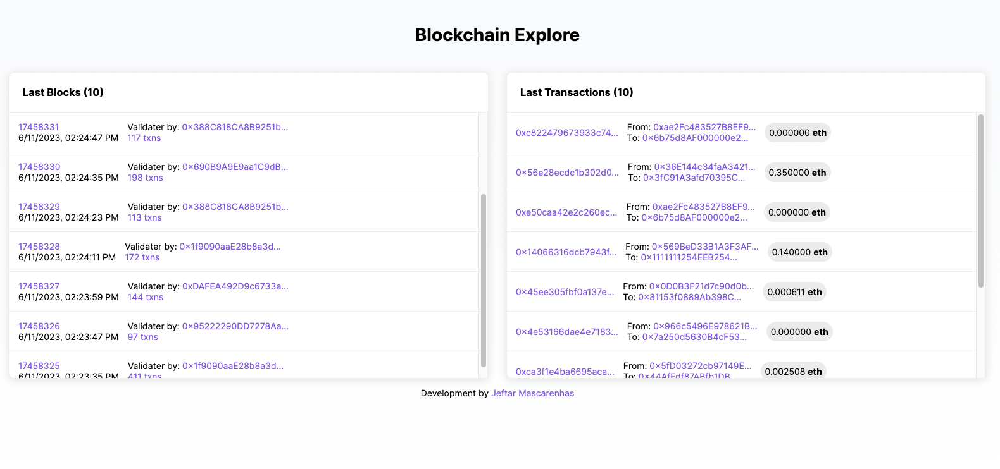

<div align="center">
<h1 >Blockchain Explorer</h1>
<p>Explorer to any EVM blockchain compatible</p>
<p>There are two branchs main and full-example, use the branch main to do the tutorial on <a href="https://youtube.com/@nftchoose">YouTube</a></p>
<p>See how I did this blockchain explorer - <a href="#">Click here</a></p>
</div>



## Getting Started

First, run the development server:

```bash
yarn
# or
yarn install
```

```bash
npm run dev
# or
yarn dev
# or
pnpm dev
```

Open [http://localhost:3000](http://localhost:3000) with your browser to see the result.

## Project is using

- Nextjs 13.4.4
- Ethersjs 6.4.2
